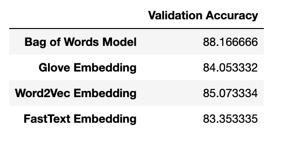
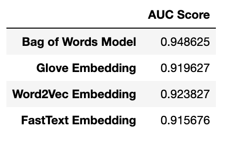
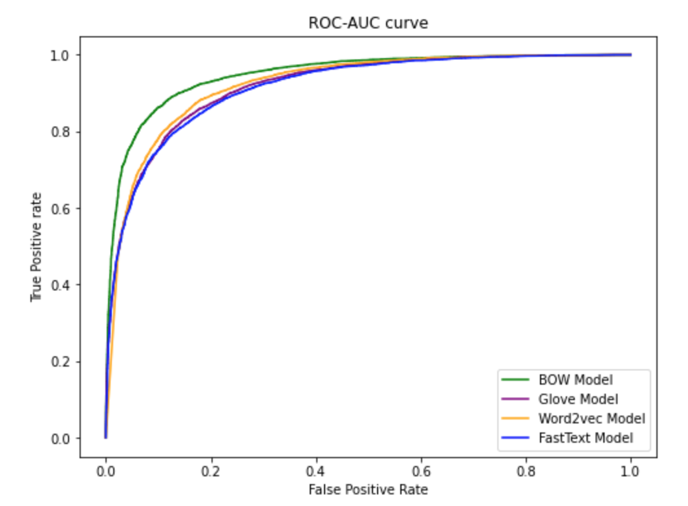

## My personal ML repository

This repository contains my attempted ML projects. Each of the folder in this repository represent attempted project.

### Amzon polarity review

This project is a sentiment analysis project on amazon polarity review dataset. The project makes use of a subset of the amazon polarity dataset (60,000) and compare the Bag of words model with embedding models like Glove, Word2Vec and Facebook FastText word embedding.

This project compares the training accuracy and the ROC-AUC score of the BoW model and the different word embedding models.

Here is the Validation Accuracy of the different models

Here is the ROC-AUC score of the different models

Here is the ROC-AUC curve of the different models

The Bag of Words model outperformed the word embedding models.

**Note** : In this project, the major pre-processing step done on the dataset is to remove just words with frequency less than 10. The dataset can be downloaded on the Hugging Face website via this [link](https://huggingface.co/datasets/amazon_polarity).

### House Prices (Advanced Regression Techniques) 

This project is about house price prediction based on some house and environment related features provided. These variables are 79 in numbers and are mix of both categorical and numerical variables. Different regression techniques are used in solving this including ElasticNet, GradientBoostingRegressor, SelectKBest, Neural network etc. To goto the Kaggle competition, click [here](https://www.kaggle.com/c/house-prices-advanced-regression-techniques)

The major reason for this project is to explore several regression techniques. Out of my predictions with different models, the prediction done with neural network performed best out with Root Mean Squared Logarithmatic Error of 0.12896 on Kaggle .

 Below is the Accuracy/Loss plot during training.
 

### Digit Recognizer 

This is a digit recognizer challenge. The training dataset is given in csv which containing numeric values between 0-255. Each numeric value represents a pixel. This was trained with three to four neural models. To goto the Kaggle competition, click [here](https://www.kaggle.com/c/digit-recognizer)

Below is the Accuracy/Loss plot during training.

### Flower Recognition

This project is for flower identification. These flowers include rose, daisy, dandellion, sunflower and tulip. To goto the Kaggle competition, click [here](https://www.kaggle.com/alxmamaev/flowers-recognition)
The training data are images (4242 in  number) and CNN is used for this classification. The data was augmented and transfer learning was used for this task. After implementation, some random data were picked online and the trained model was used to make prediction. 

Some predictions were wrong and this is because most of the images used are not images that are glaring to identify like the ones in the training data.
The images were used have the flowers in different context. e.g some are far away and tiny etc. 

Below is the prediction made with labels (indicating if wrong)

**Note** : There is still room for improvements on my CNN model for this flower recognition task.

Cheers.
