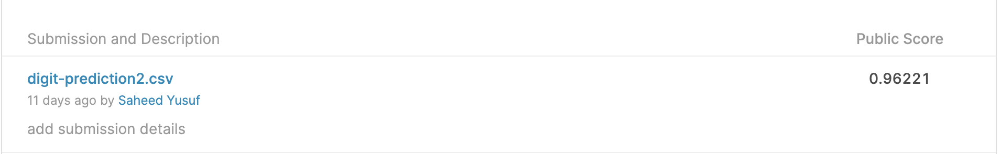
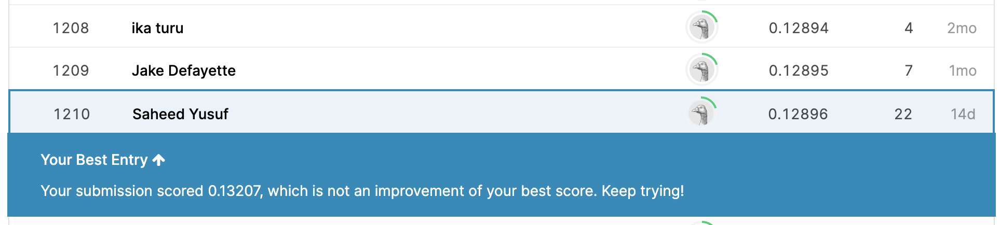
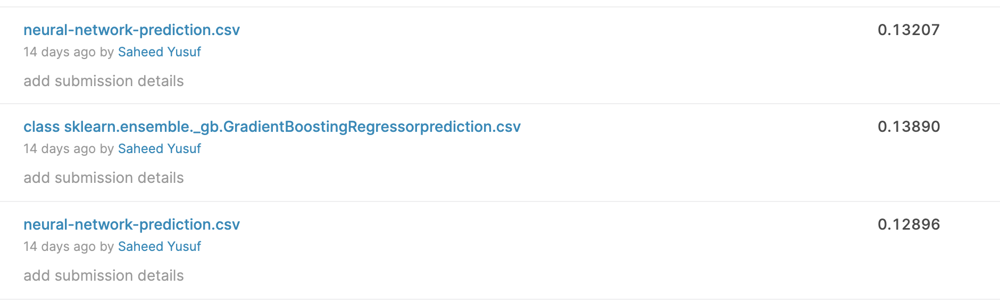
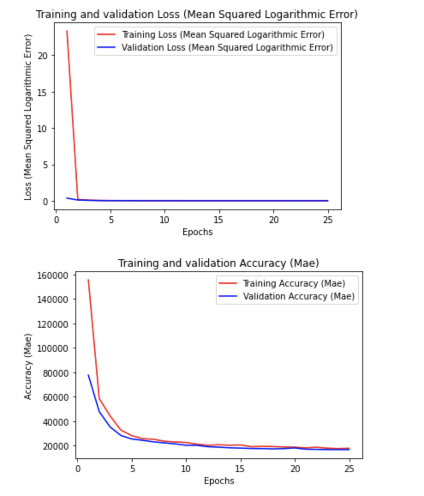
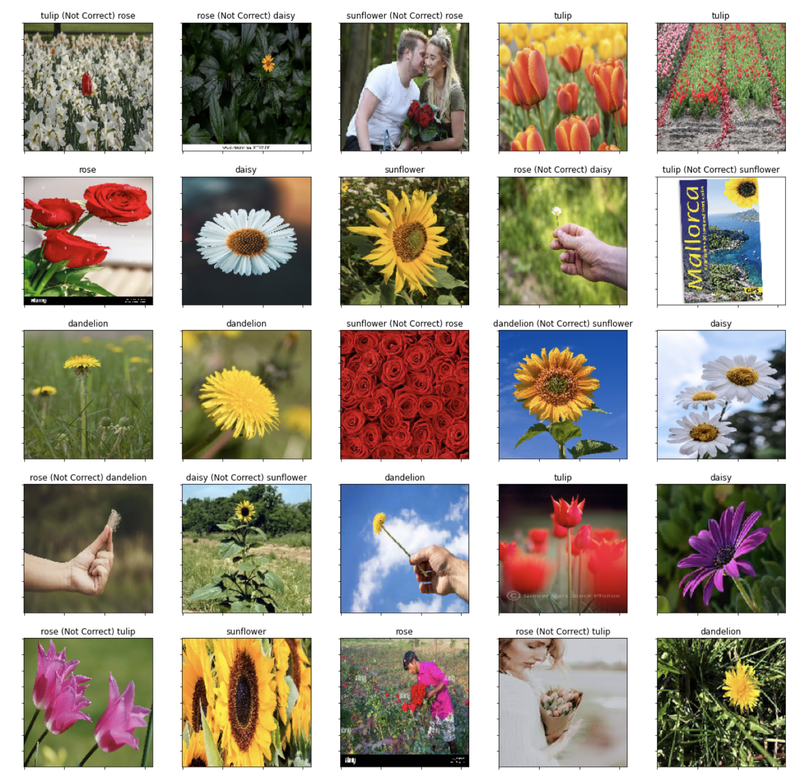
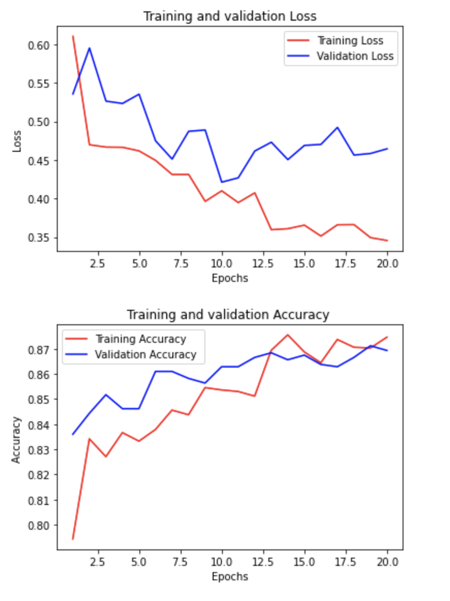

### My personal Kaggle repository

This repository contains my attempted kaggle competition projects. Each of the folder in this repository represent attempted Kaggle competition project on kaggle.

Below are the attempted projects:

1. **Digit Recognizer** : This is a digit recognizer challenge. The training dataset is given in csv which containing numeric values between 0-255. Each numeric value represents a pixel. This was trained with three to four neural models. To goto the Kaggle competition, click [here](https://www.kaggle.com/c/digit-recognizer)
The third model has the highest accuracy on Kaggle after submission with accuracy of 0.96221 (Not the best in the overral Kaggle submission but among my models).
Below is the submission ranking (as the time of writing this) on Kaggle and the loss/accuracy plot.

2. **House Prices (Advanced Regression Techniques)** : This project is about house price prediction based on some house and environment related features provided. These variables are 79 in numbers and are mix of both categorical and numerical variables. Different regression techniques are used in solving this including ElasticNet, GradientBoostingRegressor, SelectKBest, Neural network etc. To goto the Kaggle competition, click [here](https://www.kaggle.com/c/house-prices-advanced-regression-techniques)
The major reason of attempting this is not just to compete but to explore several regression techniques.
Out of my predictions with different models, the prediction done with neural network has the best out of all my models with Root Mean Squared Logarithmatic Error of 0.12896 on Kaggle (Not the best in the overral Kaggle submission but among my models).

Below is the submission ranking (as the time of writing this) on Kaggle and the loss/accuracy plot.

3. **Flower Recognition** : This project is for flower identification. These flowers include rose, daisy, dandellion, sunflower and tulip. To goto the Kaggle competition, click [here](https://www.kaggle.com/alxmamaev/flowers-recognition)
The training data are images (4242 in  number) and CNN is used for this classification. The data was augmented and transfer learning was used for this task. 
After implementation, some random data were picked online and the trained model was used to make prediction. Some poredictions were wrong and this is because most of the images used are not images that are glaring to identify like the ones in the training data.
The images were used have the flowers in different context. e.g some are far away and tiny etc. Below is the loss/accuracy plot of during training and also the prediction made with labels (indicating if wrong)

")

**Note** : I still have some improvements to do on my CNN model for this flower recognition task.

Also, more kaggle tasks would be added here and EDA would be included.

Cheers.