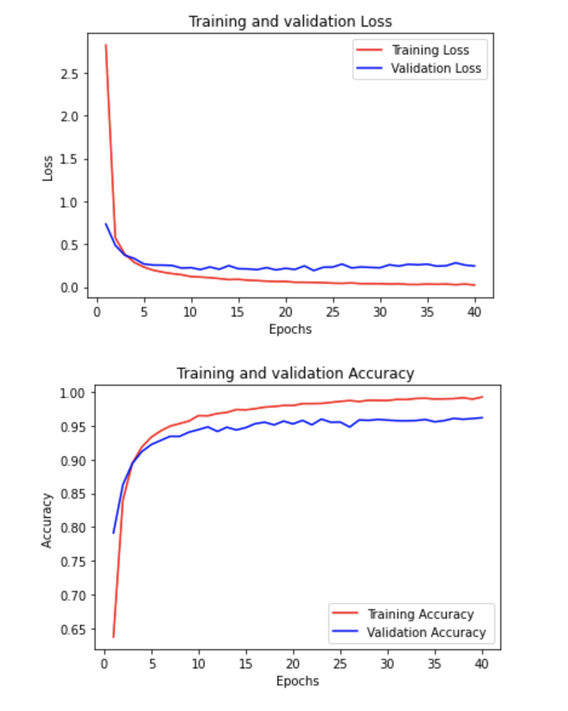

### Digit Recognizer 

This is a digit recognizer challenge. The training dataset is given in csv which containing numeric values between 0-255. Each numeric value represents a pixel. This was trained with three to four neural models. To goto the Kaggle competition, click [here](https://www.kaggle.com/c/digit-recognizer)

Below is the Accuracy/Loss plot during training.

Cheers.
